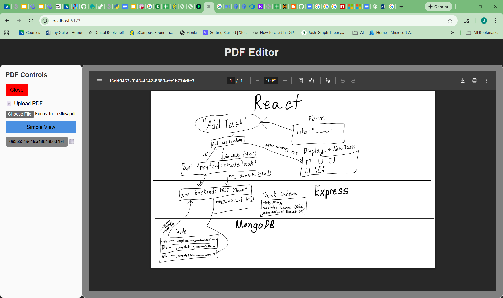
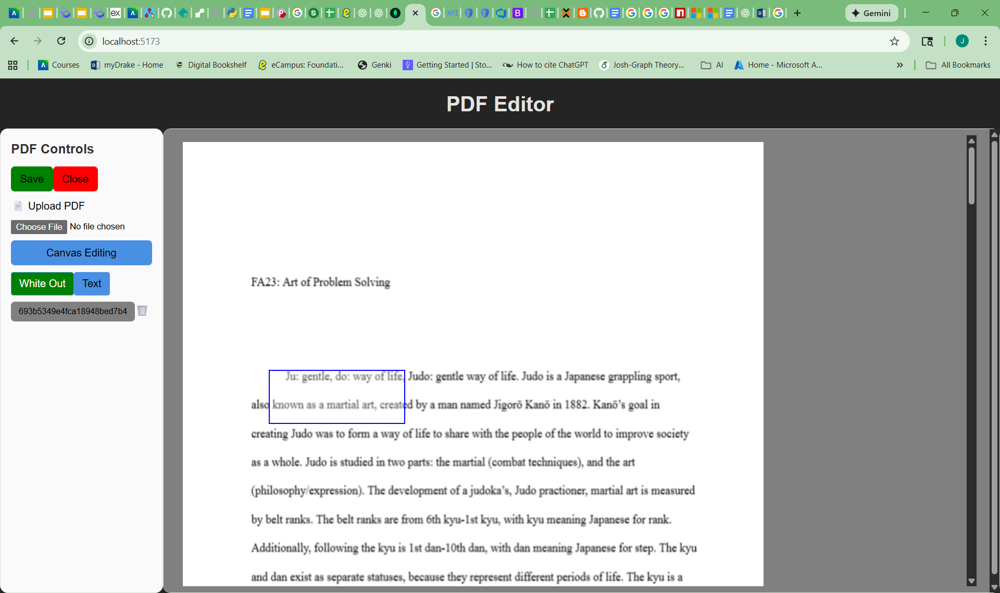
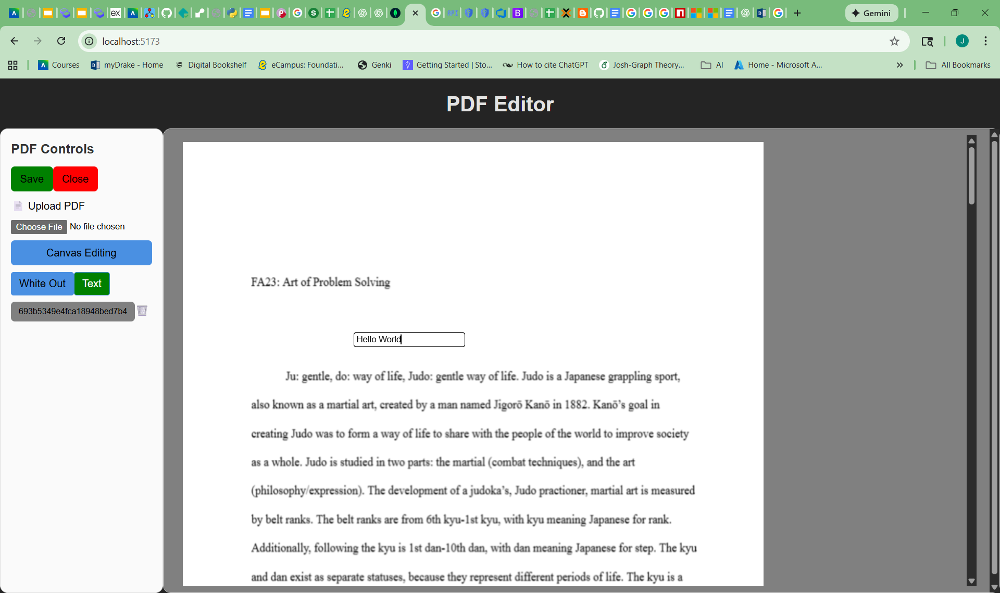
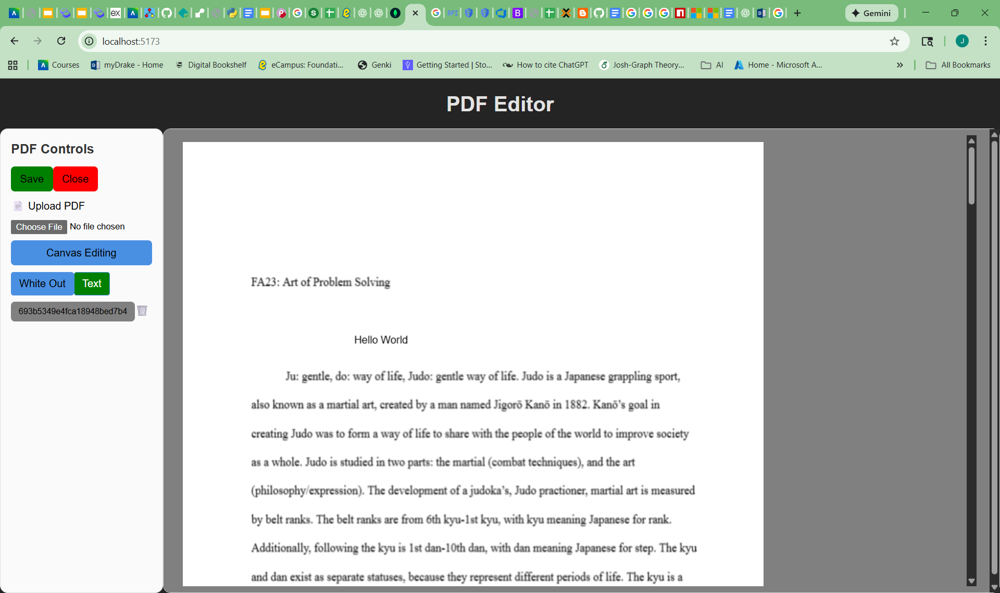

# 📘 PDF Editor

*A PDF editing tool with simple viewing/download and canvas editing, including document persistence*

---

## 🚀 Overview

* What your application does:
    * **File View**: View uploaded and saved PDF documents in a read-only iframe or an editable canvas.
    * **File Annotation**: Allows client-side editing of PDFs, including "White Out" and "Draw Text" tools.
    * **File Persistence**: Create, retrieve, update, and delete PDF documents stored in a database.

* Who it’s for:
    * Students
    * Professors
    * Document Workers

* The core problem it solves:
    * Not being able to edit a PDF if you don't have the text document the PDF was made from, by providing a web-based tool for immediate, client-side modification and persistent storage.

---

## 🌐 Live Demo

| Type | Link |
| :--- | :--- |
| **Frontend (Deployed Site)** | [https://joshpohl123.github.io/cs195-project2-JoshPohl123/](https://joshpohl123.github.io/cs195-project2-JoshPohl123/) |
| **Backend (API Base URL)** | [https://cs195-project2-joshpohl123.onrender.com](https://cs195-project2-joshpohl123.onrender.com) |

> Test these in an incognito window before submission.

---

## ✨ Features

* Create, read, update, and delete **PDFs**
* Responsive UI with reusable components
* Backend API with full CRUD operations (using Express and Mongoose)
* Data persisted in MongoDB as a `Buffer` of the PDF file bytes
* Advanced feature: *Client-side PDF annotation and generation using `pdf-lib`*
* Error handling on client + server

### **Advanced Feature**

**Client-Side PDF Annotation and Generation**: The application uses `pdf-lib` to render and edit the PDF document inside a canvas. Users can use tools like White Out or Draw Text on the canvas, and the application generates a new PDF file buffer containing these permanent edits before saving it to the backend.

---

## 📸 Screenshots

1. On open


2. File upload


3. Loaded saved PDF


4. Using whiteout feature


5. Using text pre draw


6. Using text post draw


---

## 🏗️ Project Architecture

Describe how the pieces fit together.

```
/frontend
  /src
    /components
        CanvasView.jsx
        ControlPanel.jsx
        SimpleView.jsx
    /api
        pdfs.js
    App.jsx
    main.jsx

/backend
  /models
    pdf.js
  /routes
    pdfs.js
  server.js
```

Include a sentence explaining the flow:

> The React frontend communicates with the Express backend through API routes. The backend interacts with MongoDB using Mongoose models, and environment variables are used to store secrets.

> The React components are loaded within `App.jsx`. Interactions between components are initialized by buttons within `ControlPanel.jsx` and are relayed through `App.jsx` to create a specific view or allow a specific feature to activate within `CanvasView.jsx` (whiteout or draw text).

> In the backend the `models` folder stores the MongoDB schemas that is then utilized by the routes that are created in the `routes` folder. Express is started by `server.js` which imports the routes from `routes` folder and makes them accessible on `/pdf`.
---

## 📦 Installation & Setup

### **1. Clone the project**

```bash
git clone https://github.com/JoshPohl123/cs195-project2-JoshPohl123.git
cd cs195-project2-JoshPohl123
```

---

### **2. Environment Variables**

Include a `.env.example` file in both repos.

**Backend `.env.example`:**

```
MONGO_URI=your_mongodb_url
CLIENT_ORIGIN=https://your-frontend-url.com
PORT=3001
```

**Frontend `.env.example`:**

```
VITE_API_URL=https://your-backend-url.com
```

---

### **3. Install Dependencies**

#### Frontend:

```bash
cd frontend
npm install
npm run dev
```

#### Backend:

```bash
cd backend
npm install
npm run start
```

---

### **4. Running Entire App Locally**

1. Start backend on `http://localhost:3001`
2. Start frontend on `http://localhost:5173`
3. Confirm CORS + API requests are working

---

## 🛠 API Documentation

Document the **main 3–5 routes**:

### **GET /pdf**

Returns all PDFs.

### **GET /pdf/:id**

Returns one PDF.

### **POST /pdf**

Creates a new PDF.
Body example:

```FormData - pdfData (Buffer object)
body: pdfData
```

### **PUT /pdf/:id**

Updates a PDF entry.

### **DELETE /pdf/:id**

Deletes a PDF.


---

## 🚀 Deployment Notes

Document where/how you deployed:

### **Frontend**

* Github Pages
    * Add `base: "/your-repo-name/"` under plugins in `frontend/vite.config.js` 
    * In `frontend/components/CanvasView.jsx` change `pdfjsLib.GlobalWorkerOptions.workerSrc` to = `"/your-repo-name/pdf.worker.min.js";` for proper import on pages
    * In frontend/ terminal run `npm install --save-dev gh-pages`
    * In `frontend/package.json` add bottom 2 lines:
        ```
        "scripts": {
            "dev": "vite",
            "build": "vite build",
            "preview": "vite preview",
            "predeploy": "npm run build",
            "deploy": "gh-pages -d dist"
        }
        ```
    * Then run `npm run deploy`
    * Environment:
        ```
        VITE_API_URL=https://your-backend-url.com
        ```

### **Backend**

* Render
* Environment:
    ```
    MONGO_URI=your_mongodb_url
    CLIENT_ORIGIN=https://your-frontend-url.com
    PORT=3001
    ```


---

## 🎥 Video Walkthrough

**Link to YouTube:**
[https://www.youtube.com/watch?v=eTDhAA4roqQ](https://www.youtube.com/watch?v=eTDhAA4roqQ)

* **0:00–0:30** [Intro](https://www.youtube.com/watch?v=eTDhAA4roqQ)
* **0:30–3:00** [Core/Simple features](https://www.youtube.com/watch?v=eTDhAA4roqQ&t=30s)
* **3:00–9:00** [Advanced features](https://www.youtube.com/watch?v=eTDhAA4roqQ&t=180s)
* **9:00–12:12** [Technical Overview of Advanced Features](https://www.youtube.com/watch?v=eTDhAA4roqQ&t=540s)

---

# 🧠 Reflection

### **1. What was the hardest part of this project?**

The hardest part was definitely getting the canvas for editing setup + its features. I used ChatGPT to help layout the requirements for the canvas. For the canvas the pdf (after converted to bytes) needed to be loaded into a javascript object by the module `pdfjsLib`. From that object we can extract data from the pdf like how many pages it has, the contents of the page, viewport of the page, etc. With that extracted data we can create the canvas html element (element capable of drawing graphics on) sized to the viewport of the PDF page. From there the PDF page(s) can be rendered onto the canvas. The next step was to make a transparent overly that would cover the same space as the canvas which allows for the setup of event listeners that would act as an interpreter for our actions and what would happen with the canvas. The event listeners would track mouse up/down/move to create a visual for what shapes a user could draw (rectangles) or input for text. The listener also supplied the canvas with the (x,y) cords of where to draw the shapes or where to place the text to be drawn. This allowed for a whiteout box (erase) and draw text (input text) features to edit the PDF. On each user interaction before the visuals and canvas were drawn on a snapshot of the page was store in a stack to allow deletion of previous edits. To then make the edits saveable, on save, each page of the PDF is converted to an image and added to `jsPDF` (another module) object. With that new javascript PDF it can then be converted into
back into bytes and then stored in the database.

(A lot longer than 3-5 sentences, but it was a really interesting and challenging problem to solve)

### **2. What are you most proud of?**

I am most proud of the Canvas Editing.

### **3. What would you do differently next time?**

In the last like 2 hours of designing the components I learned from ChatGPT that you can actually forward reference your component
functions and expose functions with the reference. This means that within `App.jsx` I can create a reference and apply it to my component when I use it in `App.jsx`. This makes it possible to use functions from inside of my compenents while still having context of `App.jsx`. While this isn't as important if I only need to interact between `App.jsx` and a single component as I can just pass context to the component through `App.jsx`. This does become an amazing feature when I need to have the context of `App.jsx` and multiple component features like how my React workflow feature describes. If I knew about forward referncing from the start I could have changed or not need a lot of additional extension functions that I created within components. Next time, from the start I would use forward reference on my components.

### **4. How did you incorporate feedback from the 12/5 check-in gallery?**

I followed my professor's advice on taking development slowly, and triaging what is available. I started off thinking that creating PDFs would be easier than editing, but I was wrong as PDF editing can only be done via annotations on the PDF. So from there I changed gameplans and focused on first making the PDF visible, then making a visible form that was editable and kept extending from there.

Where I did not follow advice on was working in chunks between backend and frontend. I did almost all the frontend work first, and then once I was able to create a pdf state that was savable I worked on the backend to be able to transfer that state.

I didn't really recieve any advice from other students during the check-in since I have a feeling my project idea was kind of out there for choices lol. However, for future development I want to add user segmentation. I was originally planning on using 3rd party authentication, but just about everyone in class created their own authentication. After seeing that I've changed my mind about using 3rd party auth and will create my own auth method.

---

# Acknowledgments / AI Usage Disclosure

> Include a brief note on tools used (per academic integrity guidelines):

* I used ChatGPT to research what Node Modules I needed for handling PDFs
* I used ChatGPT to create the canvas and event listeners for the editable PDF
* I used ChatGPT for debugging PDF bytes/buffer data transfers across APIs
* I used ChatGPT for Styling
* I used ChatGPT for learning about React `forwardReference` and `useImperativeHandle`
* I used ChatGPT for researching what type my pdfData/Bytes was for my MongoDB Schema
* I used ChatGPT for how to handle converting PDFs into Bytes
* I used ChatGPT for learning how to convert bytes into Blobs that can be displayed in URLs
* I used ChatGPT to make a PDF for the demo